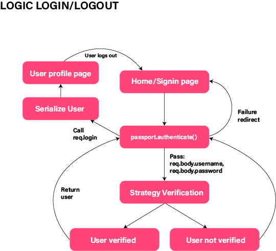

# Matching app - BookMatch

Voor het individuele gedeelte van Project Tech heb ik gewerkt aan een inlog-, uitlog en registreer functie van mijn matching app, genaamd Bookmatch.

> Your favourite book can bring you amazing people!

## Wat is Bookmatch?

Bookmatch is een matching app voor boekennerds die hun favoriete boek kunnen invoeren en op basis daarvan kunnen gebruikers elkaar liken/disliken.

## Mijn feature

## Documentatie

De documentatie van mijn project kun je vinden op mijn [wiki](https://github.com/ZahraAhmadi4/matchingapp-zahra/wiki).

## Installatie

1. Download Node.js via deze [link](https://nodejs.org/en/download/).
2. Installeer node door `node install` in de terminal in te voeren.
3. Als je het al geinstalleerd hebt kun je het checken door de volgende commando in te voeren. `node -v`

4. Vervolgens installeer je git in je terminal door `git install` in te voeren.
5. Om de repository lokaal te clonen voer je het volgende in in de terminal: `git clone https://github.com/ZahraAhmadi4/matchingapp-zahra`
6. Install NPM door `npm install` in te voeren in de terminal.
7. Als je het al geinstalleerd hebt kun je het checken door de volgende commando in te voeren. `npm -v`

## De applicatie starten

Door `npm run dev` in te voeren kun je de applicatie starten en deze kan bekeken worden op localhost:4000.

## Gebruikte technologieen

- Node.js
- Express
- EJS
- MongoDB

## License

MIT License
